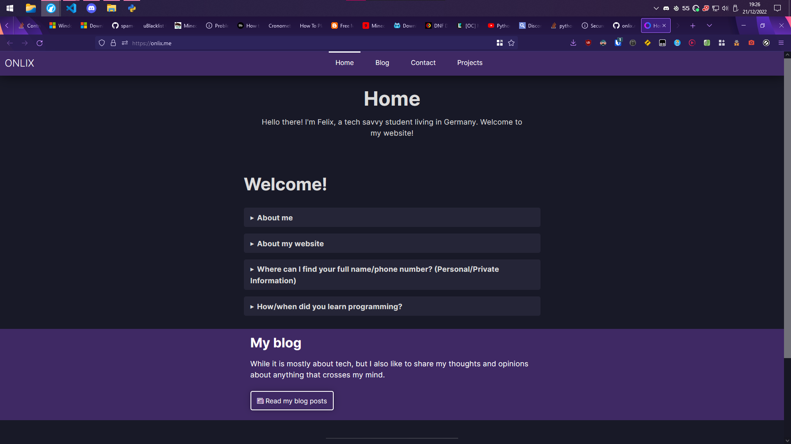

# My website » [ONLIX.ME](https://onlix.me)
The source code of my website, **onlix.me** (2021-2023).



## Self-hosting
Do you want to...
- Understand how my website works?
- Build your own project which is similar to mine?

Simply self-host my website! To be honest, easier said than done, since there might be a lot of things to set up first. I suggest deleting all unnecessary files, such as **everything in...**

- `onlix/templates` (web pages) **...except:**
    - Files in `components` (to keep the Jinja2 templates)
    - `home.html` (as a reference) 

- `onlix/blog` (blog posts) **...except:**
    - A blog entry of your choice, might be needed for testing purposes

- `onlix/static` (assets/media) **...except:**
    - `/styles` (style sheets) - otherwise, the website will look horrible
    - `/scripts` (JavaScript scripts) - otherwise, some buttons etc. won't work properly

**Warning:** I don't push every single file which is on my server. This can have several reasons. Generally, this GitHub repository is here for transparency purposes, not for cloning my website. Feel free to check my `.gitignore` and its comments to learn more.

<!-- - `/*.py` ***...EXCEPT:**
    - `web.py` (runner)
    - `main.py` (homepage)
    - `tools.py` (utility modules) -->

You also need to download/generate and accordingly copy the files listed in the `.gitignore` at the upper section

### Troubleshooting
#### `ModuleNotFound`
Please make sure you have installed all required depencies: `pip install -r requirements.txt`

#### `FileNotFoundError`
Please report those issues, even if the workaround works! That way, I can safe other people time :).

Alright, a possible workaround is to simply create the missing files or directoryies.

Take a look at the error traceback and try to figure out which (nonexistent) file in which (nonexistent) folder caused the error.

#### `PIL` (also called "pillow") (Linux)
Problems with PIL on Linux? Choose your distribution and run the following commands.

1. Follow the steps for your distribution:
  - **Debian-Based (e.g. Ubuntu/Linux Mint/PopOS)**
```sh
sudo apt install libjpeg-dev zlib1g-dev
```
 - **Arch Linux-Based (e.g. EndeavourOS, Manjaro)**
```sh
yay -S libjpeg zlib
```

2.
```
pip install Pillow
```

This will ensure all needed dependencies are installed.
